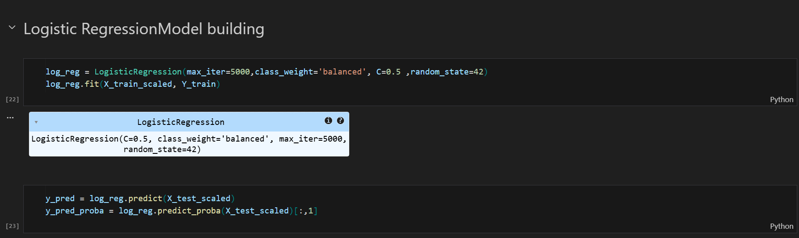
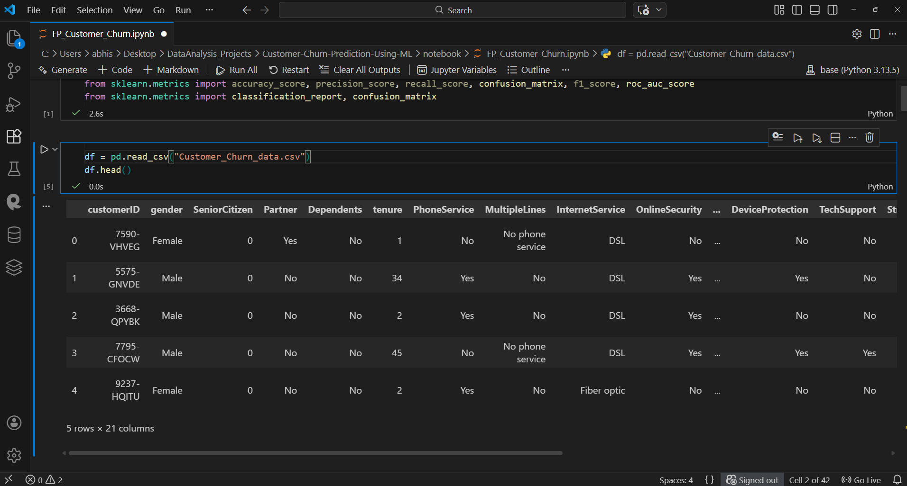
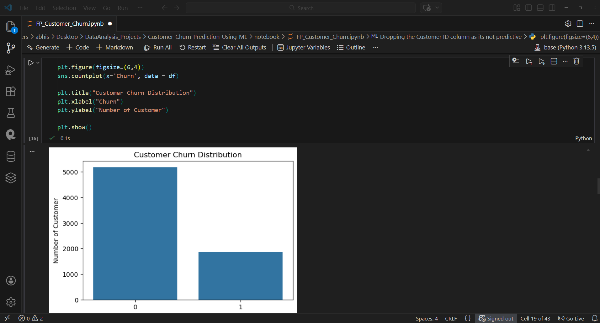
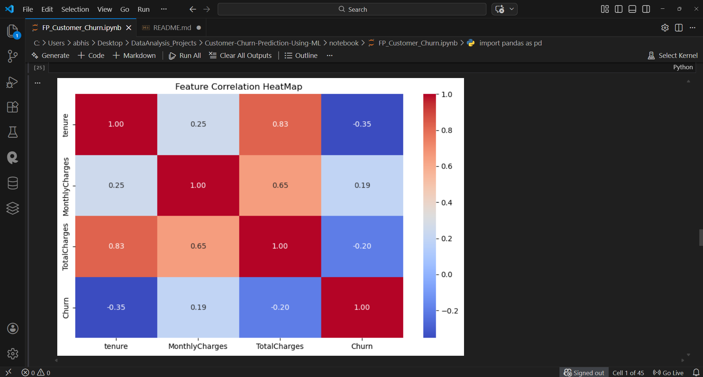
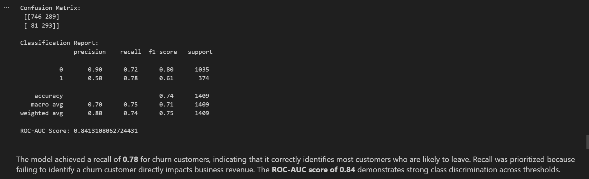

# 🤖 Customer Churn Prediction (Machine Learning Project)

## 📑 Table of Contents

- <a href="#project-overview">🔎 Project Overview</a>
- <a href="#tech-stack">🛠 Tech Stack</a>
- <a href="#project-structure">📂 Project Structure</a>
- <a href="#work-flow">🧠 Work Flow</a>
- <a href="#model-used">🤖 Model used</a>
- <a href="#result">💡 Result</a>
- <a href="#project-report">📄 Project Report</a>
- <a href="#future-improvements">🚀 Future Improvements</a>
- <a href="#author-contact">📎Author & Contact</a>

<h2><a class="anchor" id="project-overview"></a>🔎 Project Overview</h2>
This project focuses on predicting customer churn using machine learning techniques. 
Customer churn prediction helps organizations identify customers who are likely to stop using their services. 
By identifying these customers early, businesses can take preventive actions to improve retention.

The project performs data cleaning, exploratory data analysis (EDA), feature engineering, and model training 
to predict churn using classification algorithms.

## Objectives
- Analyze customer behavior and service usage patterns
- Identify factors that contribute to customer churn
- Build a machine learning model to predict churn
- Evaluate model performance using classification metrics

<h2><a class="anchor" id="tech-stack"></a>🛠 Tech Stack</h2>

- 🐍 **Python**
- 🐼 **Pandas**
- 🔢 **NumPy**
- 📈 **Matplotlib**
- 🎨 **Seaborn**
- 🤖 **Scikit-Learn**
- 📓 **Jupyter Notebook**
- 💻 **VS Code**

---

<h2><a class="anchor" id="project-strucutre">📂 Project Structure</a></h2>
```
Customer_Churn_Project/
│
├── README.md
├── REPORT.md
│
├── notebook/
│     ├── FP_Customer_Churn.ipynb
│
├── screenshots/
│   ├── data_distribution.png
│   ├── confusion_matrix.png
│   └── model_performance.png
```
---

<h2><a class='anchor' id='work-flow'></a>🧠 Work Flow</h2>
1. Data Loading
2. Data Cleaning
3. Handling Missing Values
4. Outlier Treatment
5. Exploratory Data Analysis
6. Feature Engineering
7. Model Training
8. Model Evaluation

- <a href="#model-used">🤖 Model Used</a>

- Logistic Regression


## Evaluation Metrics
- Accuracy
- Precision
- Recall
- F1 Score
- ROC-AUC

## 📸Screenshots

### Data Preview


### Churn Distribution


### Correlation Heatmap


### Confusion Matrix



- <a href="#result">💡 Result</a>

The trained model predicts whether a customer will churn or not based on customer demographics, account details, and service usage.

The model achieved a recall of **0.78** for churn customers, indicating that it correctly identifies most customers who are likely to leave. Recall was prioritized because failing to identify a churn customer directly impacts business revenue. The **ROC-AUC score of 0.84** demonstrates strong class discrimination across thresholds.

- <a href="#project-report">📄 Project Report</a>

 Full Project Report:  
[Customer Churn Prediction Report](report/Customer_Churn_Project_Report.pdf)

- <a href="#future-improvements">🚀 Future Improvements</a>
- Use advanced models such as Random Forest or XGBoost
- Perform hyperparameter tuning
- Deploy the model using Streamlit or Flask
- Integrate with a real-time prediction system

<h2><a class="anchor" id="author-contact"></a>📎Author & Contact</h2>  

Aspiring Data Analyst transitioning from IT administration to data analytics.

**Abhishek Bhavikatti** 
  - Data Analyst 
  - 📧 Email: bhavikattiabhishek07@gmail.com
  - 🔗 [LinkedIn](www.linkedin.com/in/abhishek-bhavikatti-93a482231)
